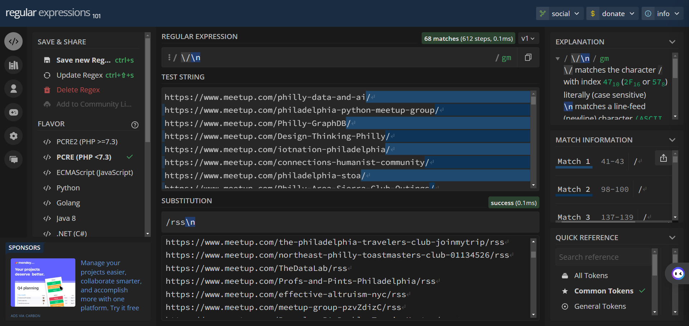

Have you ever wanted to keep track of your [Meetup.com](https://meetup.com/) events using [RSS](https://rss.com/blog/how-do-rss-feeds-work/)? 

Me too!

This handy procedure provides instructions for receiving **new Meetup.com events** in your RSS reader:

## Instructions
1. Navigate to the **["Your groups" page on Meetup.com](https://www.meetup.com/groups/)**.
2. Open each of your desired groups in a new tab.
3. Copy and paste the URL of each Meetup group into a text file.
    - If you're using Google Chrome, you can use [Bulk URL Opener](https://chromewebstore.google.com/detail/bulk-url-opener/kgnfciolbjojfdbbelbdbhhocjmhenep) to generate a list of URLs from your active tabs.
4. Convert each URL to RSS using `regex`:
   1. Open **[Regex101](https://regex101.com/)** in a new tab.
   2. On the left sidebar, select **Substitution**.
   3. Underneath "Regular Expression", type `\/\n`.
   4. Underneath "Substition", typ `/events/rss\n`. This URL corresponds to the RSS feed of the Meetup group's events page.
5. Copy the new list of URLs into an online [OPML](http://opml.org/) generator, such as [Riz Tools OPML Generator](https://dotriz.com/tools/opml-generator/).
6. Generate an `.opml` file using the site. The site may also return an `.xml` file - this is fine to use as well.
7. Import the `.opml` into your RSS reader.

