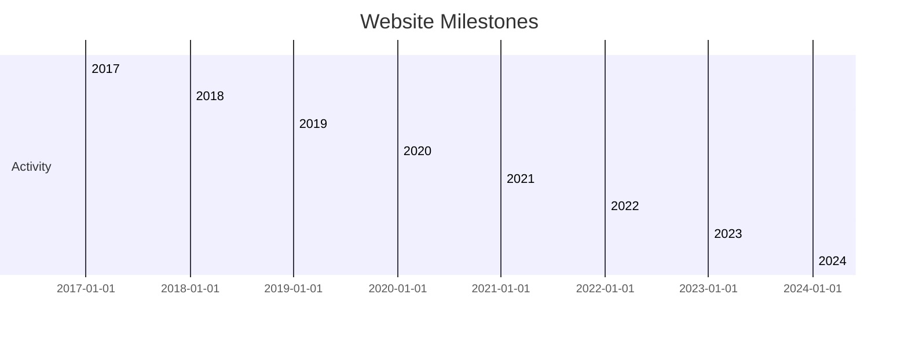

:::note[Overview]

Welcome to my personal website, which has seen many iterations since its start in 2017. This site serves as a place to showcase my work, document my personal and professional interests, and share insights and resources with others. Originally a basic [WordPress](https://wordpress.org/) site, it has since evolved into a modern, static site built with [markdown](https://www.markdownguide.org/), [MDX](https://mdxjs.com/), and [React](https://react.dev/), powered by [Docusaurus](https://docusaurus.io/) and hosted (for free!) on [Vercel](https://vercel.com/).

:::

## Background & Motivation
I started this website in 2017 to showcase my [undergraduate engineering projects](/projects/category/undergraduate-mechanical-engineering) and share my background and interests with the rest of the world. At the time, I was in my 2nd year of undergrad and utilized [CollegeInfoGeek's website creation guide](https://collegeinfogeek.com/personal-website/) to get the site up and running.

## Development

### Late 2022
Shortly after learning of [Docusaurus](https://docusaurus.io/) from a friend, I decided to migrate my website from a [Wordpress](https://wordpress.com/) site hosted on [HostGator](https://www.hostgator.com/) to a Docusaurus site hosted (for free!) on [Vercel](https://vercel.app/). 

Why? While Wordpress + [Themify Builder](https://themify.me/builder) allowed me to create a half decent looking site, it cost $15 per month to host the site and there was a lot to be desired in terms of customization.