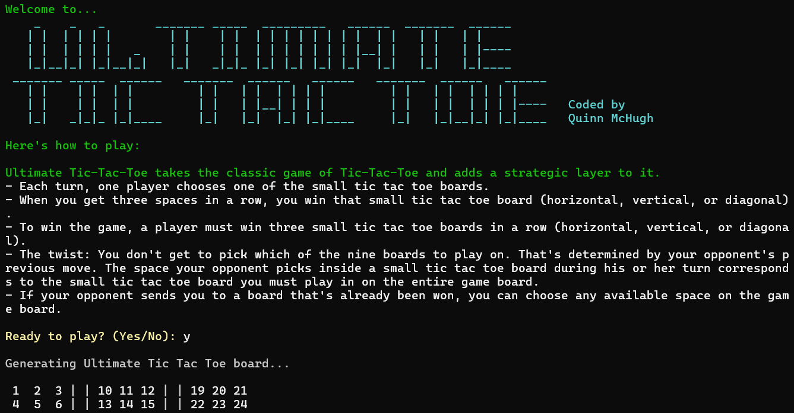
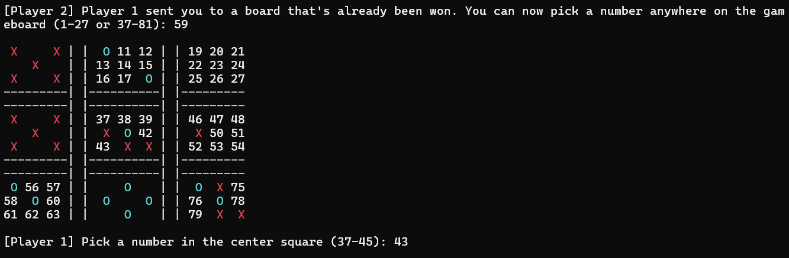
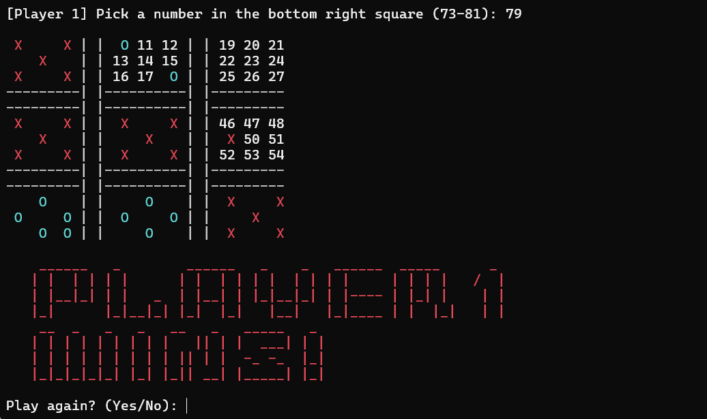

In the spring of 2016 for my Computer Science and Programming course, I created a text-based program in C++ to play a game called Ultimate Tic Tac Toe in C++ to help sharpen my coding skills. Essentially, Ultimate Tic Tac Toe is a much more complicated and strategic version of classic Tic Tac Toe that will certainly test both you and your opponent's mental ability.

## Gallery

**Start Screen:**

**Mid-Game:**

**End Game:**
