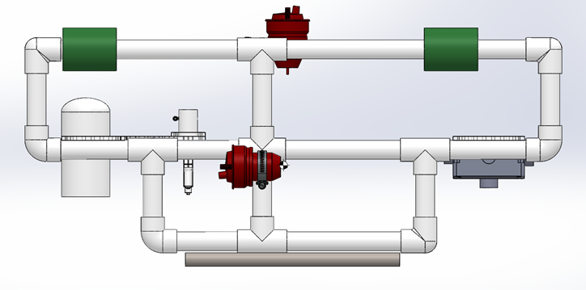
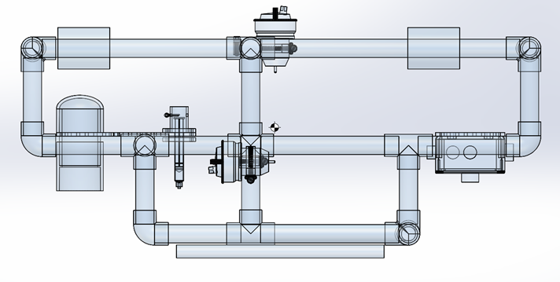
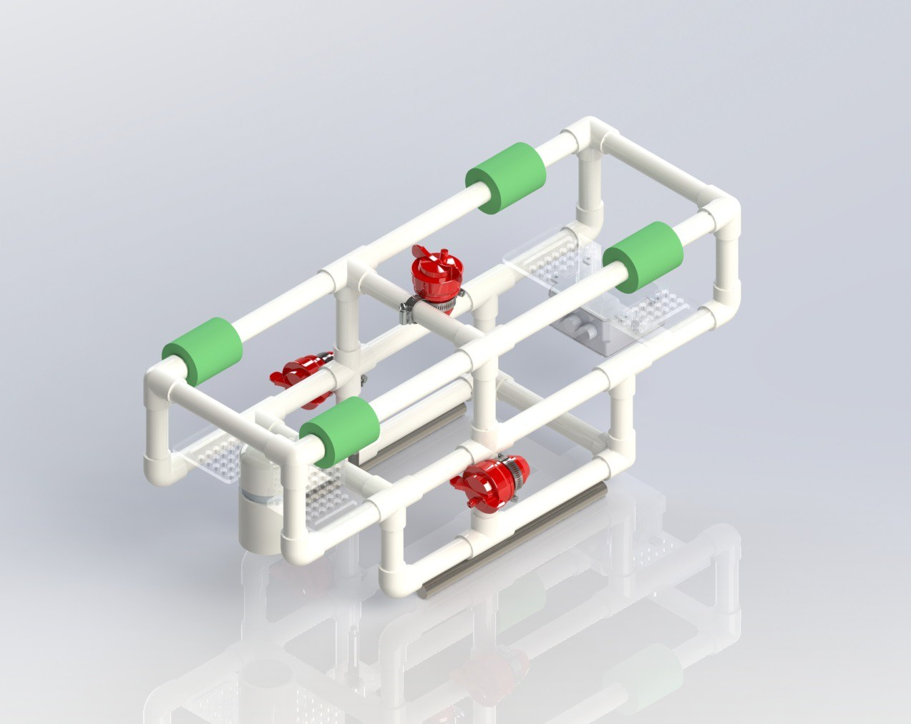
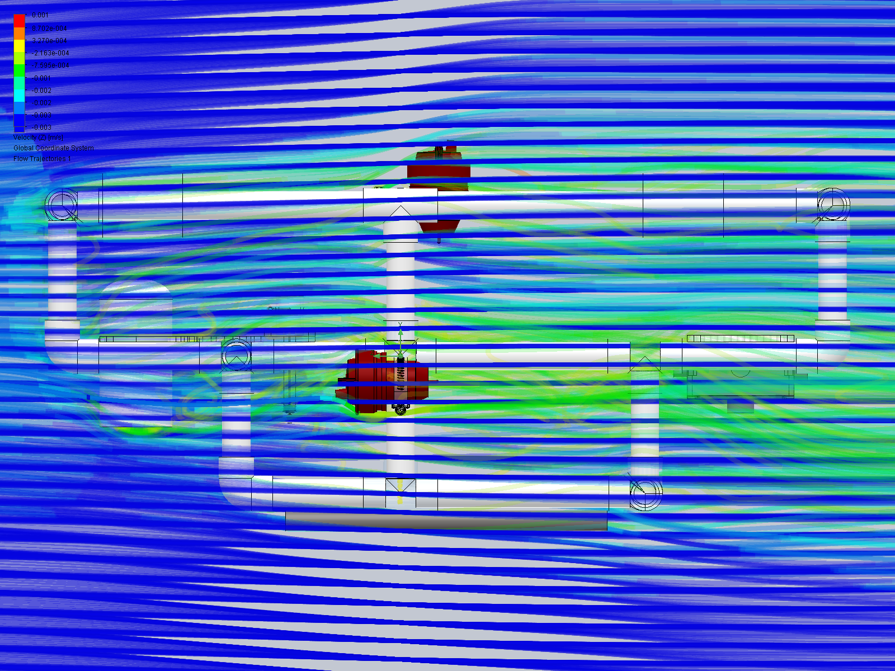
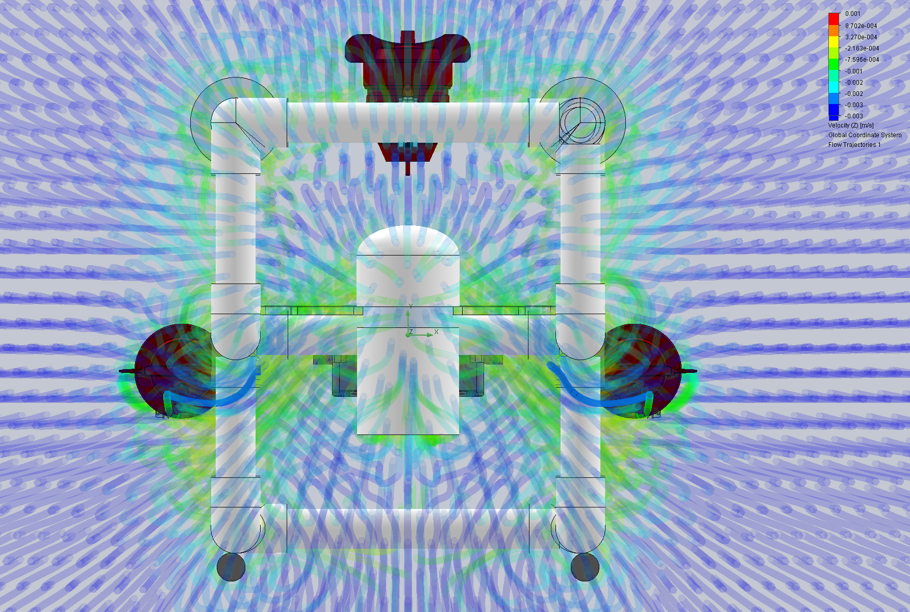
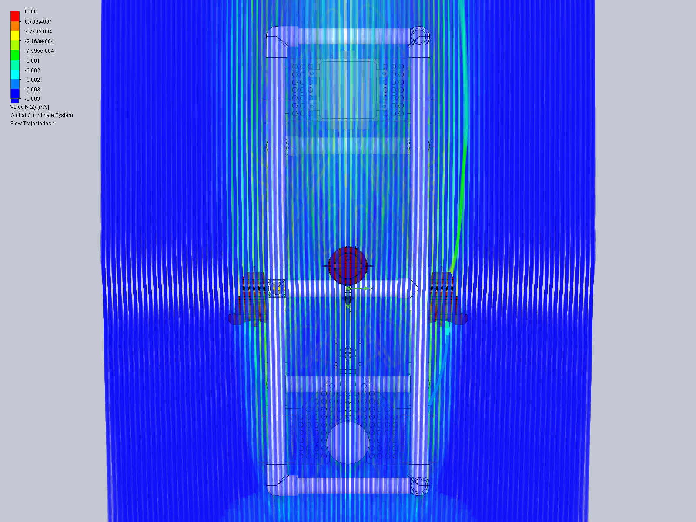
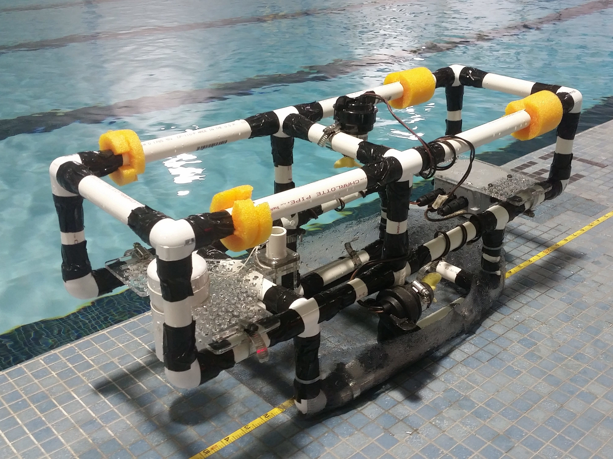
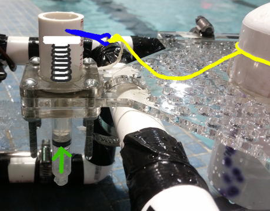
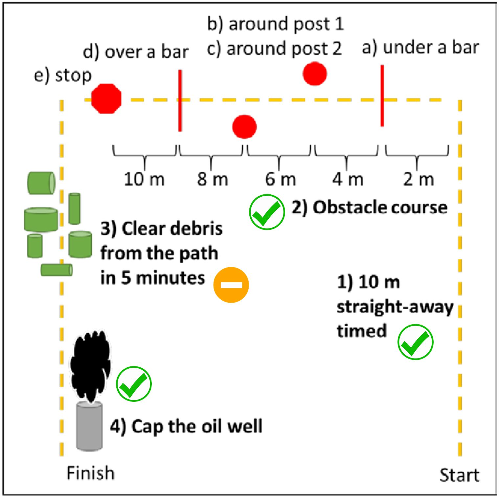

During my spring 2017 semester at Rowan University, a team of 4 electrical engineering students and I created an
underwater remotely operated vehicle (U.R.O.V.) to perform a series of tasks while submerged as part of my Sophomore
Engineering II course. The U.R.O.V. was designed in SolidWorks and its speed, maneuverability, and stability were
optimized using SolidWorks and SolidWorks Flow Simulation. The objectives of the project were as follows:

1. Travel along a 10m straightaway in the fastest time possible.
2. Successfully navigate a PVC obstacle course.
3. Clear a field of debris by collecting and bringing it to the top of the pool.
4. Cap an “oil well” by successfully placing a PVC cap on top of a pipe on the bottom of the pool.
5. Collect a water sample near the area where the “oil well” is located.

## Results & Discussion
During our final test, the U.R.O.V. performed exceptionally well and, even though it was able
to collect only one piece of debris from the bottom of the pool, it performed every other task without fail. Since we
allocated a considerable amount of time towards maximizing the stability of our UROV using a 2k factorial design
process, the device ended up being one of the most maneuverable UROVs developed during the semester, despite being
fairly large in size.

To collect the water sample near the area where the “oil well” was located, our team devised a particularly elegant
solution. When the PVC cap was placed onto the “oil well” and the UROV would move in reverse, the PVC cap would slide
off of our PVC cap holder and cause a small cotter pin holding back a spring-actuated syringe to be yanked out of a
small hole. The spring inside the syringe would then actuate, causing the syringe to automatically collect a water
sample moments after the “oil well” was capped.

## My Contribution
Considering I was the only mechanical engineering major on our team, I did a vast majority of the
work related to 3D modeling, performing fluid simulations, and optimizing the U.R.O.V.'s stability . As a result, I
learned _a ton_ about SolidWorks modeling, assembly configurations, and flow simulations.

## Gallery

### CAD

#### Render

### Flow Simulation
Flow simulations were performed using [SolidWorks Flow Simulation](https://www.solidworks.com/product/solidworks-flow-simulation).

### Build

**Debris Collection Cage:**

**Tether Mount:**

**Water Collection Mechanism:**

### Obstacle Course
