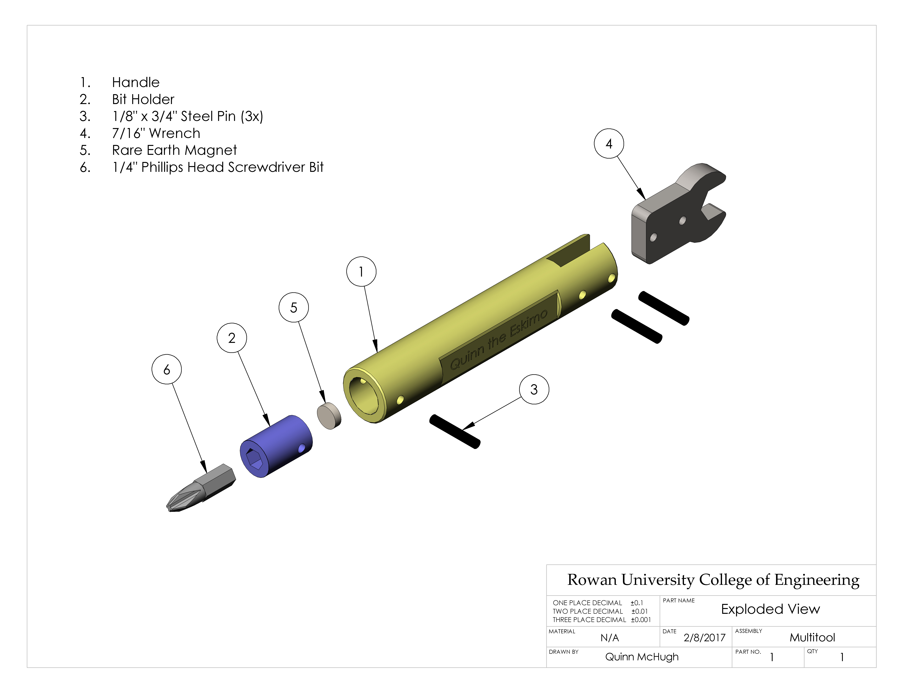
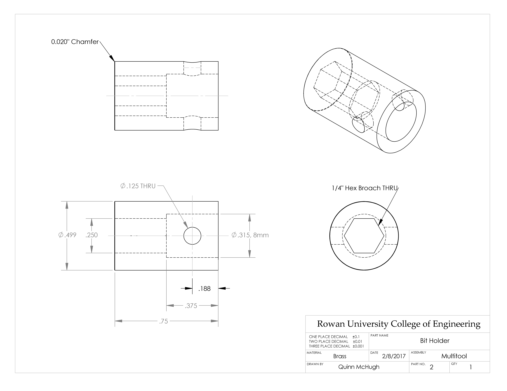
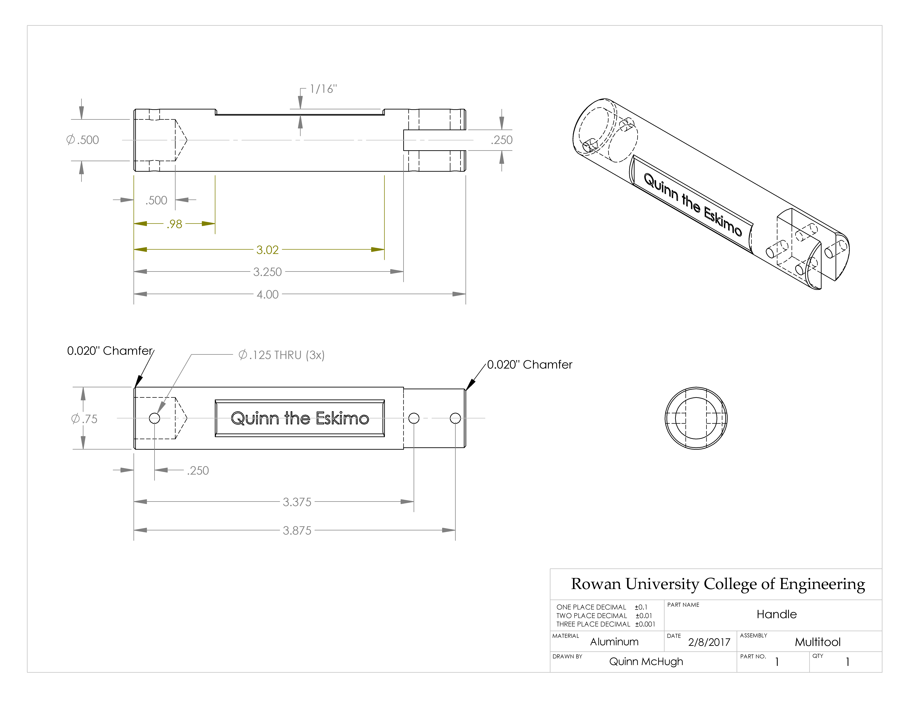
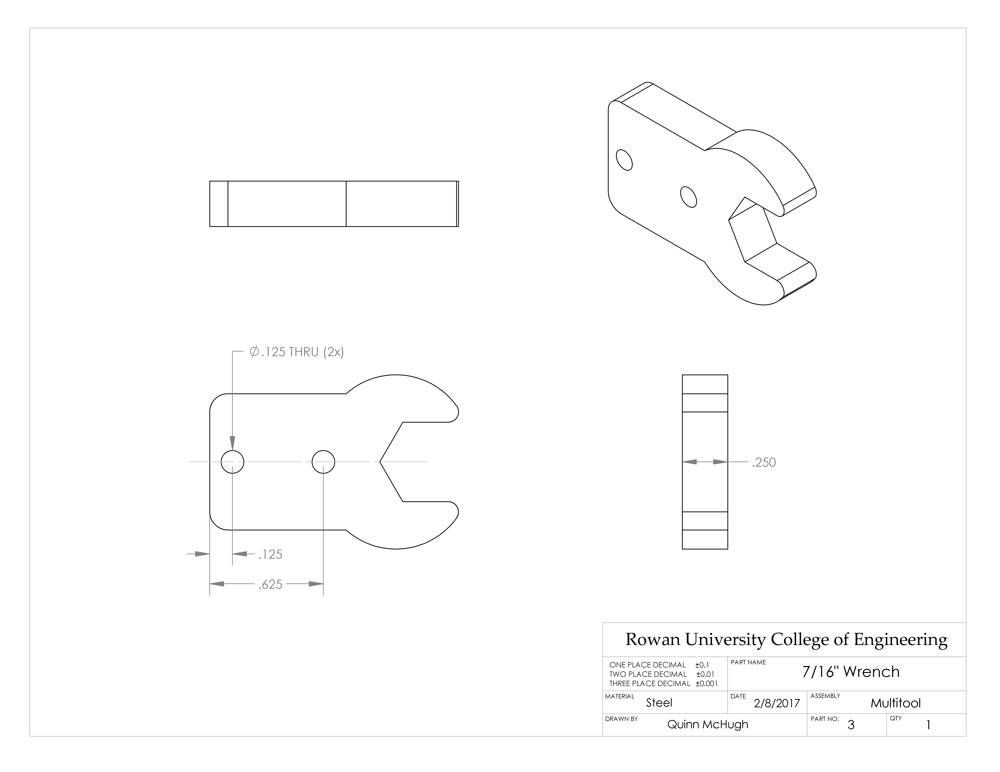

To conclude the spring 2017 semester, I was tasked with machining a multitool
using a set of standard, 3-view drawings of each component. The wrench was cut
from a 3/16″ sheet of steel using a water jet. The brass piece, used for holding
a 1/4″ screwdriver bit with a small magnet, was turned on a lathe. The handle of
the multitool was machined from an aluminum rod using a lathe and a mill.

## Gallery

