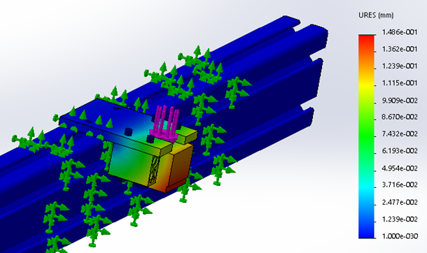

During my fall 2017 and spring 2018 semesters at Rowan University, I helped develop a 3-in-1 laser cutter, CNC mill, and 3D printer, referred to as the “modular fabrication system,” as part of a multidisciplinary team of 12 engineering students.

## Motivation
The project was spearheaded by a friend of mine and fellow Rowan engineering student, [Peter Genovese](https://www.linkedin.com/in/peter-genovese-iv-424b82105/), and sought to develop a more versatile and economical alternative to current CNC milling, 3D printing, and laser cutting devices on the market. The device's primary target audience was hobbyists and small businesses, who may not have the capital or space available to purchase and store a separate 3D printer, CNC mill, and laser cutter outright.

## My Contribution
While I was involved with the project, I worked as part of the “frame team” and designed the base plate and vertical motion system of the device, created an equation-driven “skeleton frame” to enable easy modification the frame dimensions of the device, and performed basic finite element analysis using SolidWorks Simulation to ensure all frame components could withstand CNC milling and plunging forces with a factor of safety of 3.

In addition to working on the frame team, I occasionally collaborated with the “head team”, tasked with designing the interchangeable head mechanism of the device, as well as the “electronics team”, tasked with developing the device's electrical setup and creating custom software for the device using Python.

## Challenges
For me, the primary challenges I faced in completing my tasks were getting SolidWorks Simulation to successfully run FEA simulations involving multiple components. Often, if parts were incorrectly contacted, the simulation would fail or give wildly inaccurate results. As a result, my FEA partner, Leslie, and I learned quite about the intricacies of the software.

In hindsight, [ANSYS](https://www.ansys.com/), [ABAQUS](https://www.3ds.com/products-services/simulia/products/abaqus/), or [Patran](https://hexagon.com/products/patran) should have been used instead of [SolidWorks Simulation](https://www.solidworks.com/product/solidworks-simulation) due to their superior capabilities. Unfortunately, our team did not have access or the budget to purchase such programs.

Below, you can view a gallery of some of the things that were worked on during the fall 2017 and spring 2018 semesters:

## Gallery

### CoreXY Positioning System

### Vertical Motion System

### Interchangeable Head

### CoreXY Positioning System

### Finite Element Analysis (FEA)
**Frame (Stress):**

**Frame (Strain):**

**Build Plate:**

**Build Plate Bracket:**

**Vertical Motion Bracket:**

### Electronics
**First day of electronics testing:**

**Electrical Schematic for 3D Printer:**

### Build

