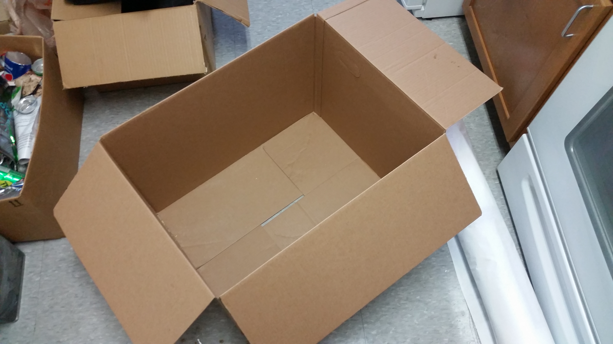
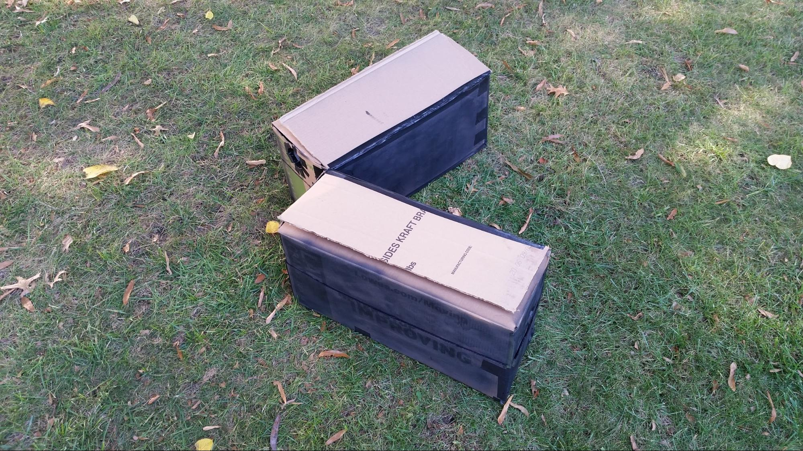
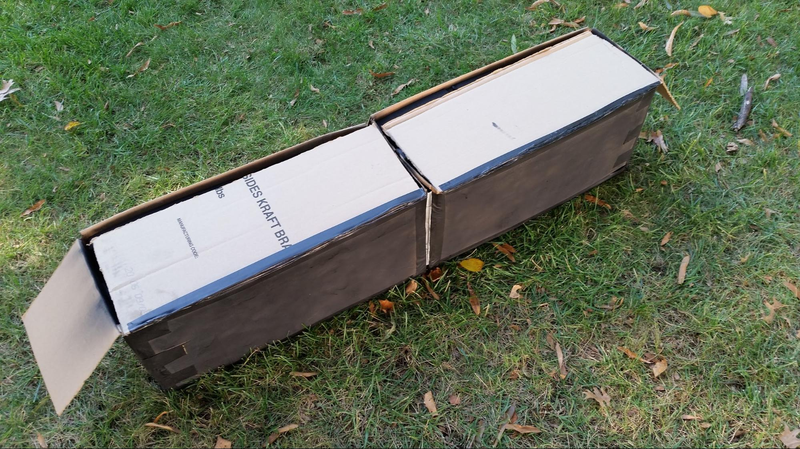
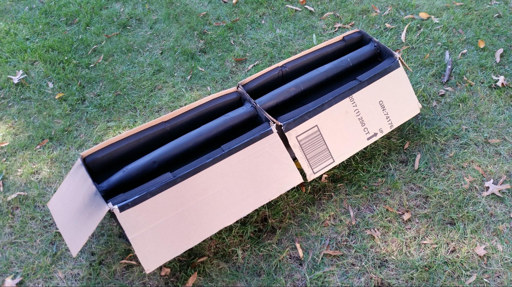
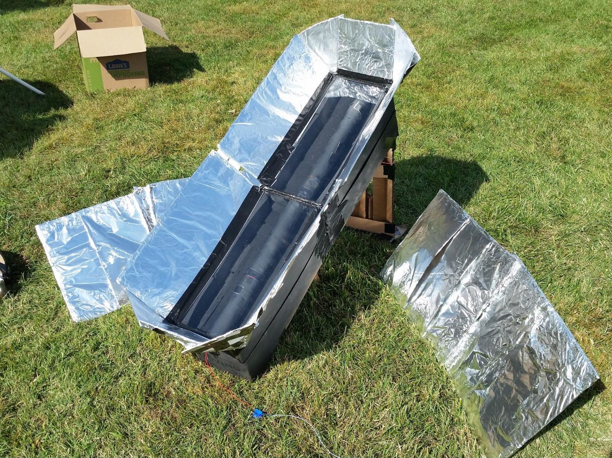

During my fall 2017 semester at Rowan University, a fellow engineering student and I were tasked with designing, constructing, and optimizing a solar air heater capable of fitting inside a 24″ x 18″ x 18″ rectangular prism as part of our Thermal-Fluid Sciences I course. The overall goal of the project was to maximize two of the following three parameters: temperature rise from ambient (inlet) conditions to outlet temperature (△T), average total heat flow generated (dQ/dt), and average overall efficiency of conversion of solar energy flow to sensible heat flow (η). For our solar air heater, we chose to focus on achieving the highest temperature change from ambient conditions (△T) and average total heat flow generated (dQ/dt).

## Constraints
During our initial introduction to the project, the following design guidelines and constraints were set forth:
- The solar air heater must initially fit inside the dimensions corresponding to the provided large moving box (24” x 18” x 18”)
- Each team will have 10 minutes prior to the start of the warm-up period to deploy its solar air heater.
- The provided box – intact or in part – may be used as part of the heater, but it does not have to be.
- The design should provide a single outlet compatible with the 40mm x 40mm dimensions of the provided fan.
- Teams may acquire their own supplies derived from generally available household and office products.

## Solutions
After going through a few design iterations, my partner and I settled on a foldable design that featured
two identical compartments housing two, straight air channels. These channels were constructed using a series of nested aluminum cans, chosen for their high thermal conductivity and availability. We spray painted these cans with matte black paint to increase the amount of energy the channels could absorb from the sun and surrounded the channels with layers of black foam insulation to help maximize the temperature inside each compartment. We added a single sheet of clear acrylic to the top of each compartment to allow sunlight to radiate the air channels inside but also prevent that heat from escaping into the surrounding environment.

The flaps of our moving box were used as makeshift mirrors to direct additional light towards the two air channels by covering each flap with a layer of aluminum foil. Ideally, these flaps should have formed a parabolic shape with their focus directly onto each air channel but due to material limitations, we were unable to achieve such a profile. Lastly, we constructed a small tower out of additional cardboard to lift our device such that it formed a 45 degree angle with the ground. Not only did this increase the amount of solar irradiation we could capture, but it also increased our average total heat flow — the difference in air temperature between the inlet and outlet of our device would induce natural convection.

## Results
Overall, our solar air heater performed exceptionally well, achieving the second highest max temperature in
the class. The solar air heater's quantitative performance is shown in the table below:

<table>
    <tbody>
        <tr>
            <td>Max Temperature (Tmax)</td>
            <td>158°F</td>
        </tr>
        <tr>
            <td>Ambient (inlet) conditions to outlet temperature (△T)</td>
            <td>48°F </td>
        </tr>
        <tr>
            <td>Average total heat flow generated (dQ/dt)</td>
            <td>62 W</td>
        </tr>
        <tr>
            <td>Average overall efficiency of conversion of solar energy flow to sensible heat flow (η) </td>
            <td>19.2%</td>
        </tr>
    </tbody>
</table>

## Challenges
Since we were only given a small fan, a 24″ x 18″ x 18″ moving box, and a single spray can of matte
black paint to construct our design, sourcing materials, such as black foam, acrylic, aluminum foil, and duct tape, was likely the most challenging aspect of the project. Upon finding these materials, however, constructing the device was relatively straightforward and aesthetics aside, I was very pleased with our final design.

## Gallery

### Preliminary Sketches

### Final Sketches

### Materials

### Build
**Partially Deployed:**

**Fully Deployed:**

