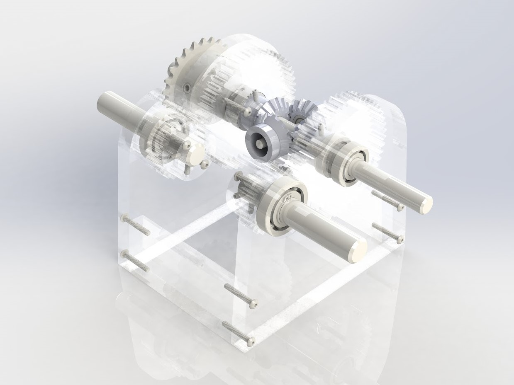
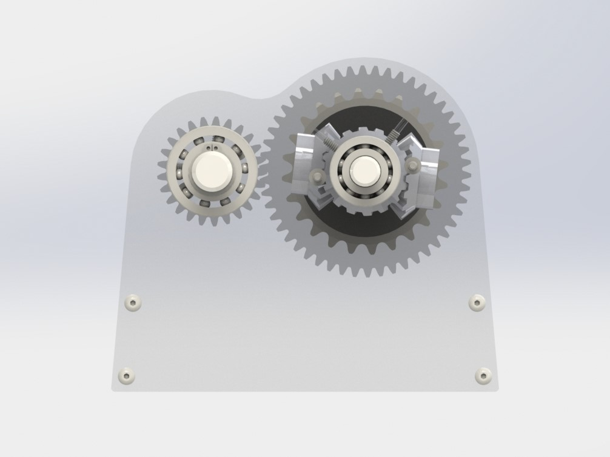
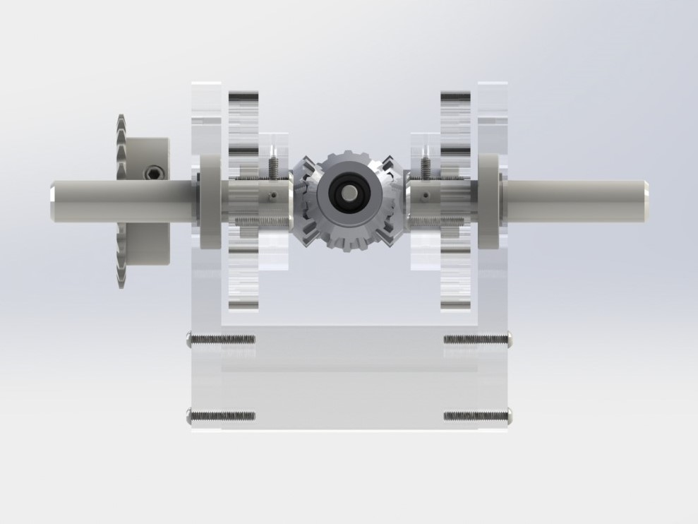
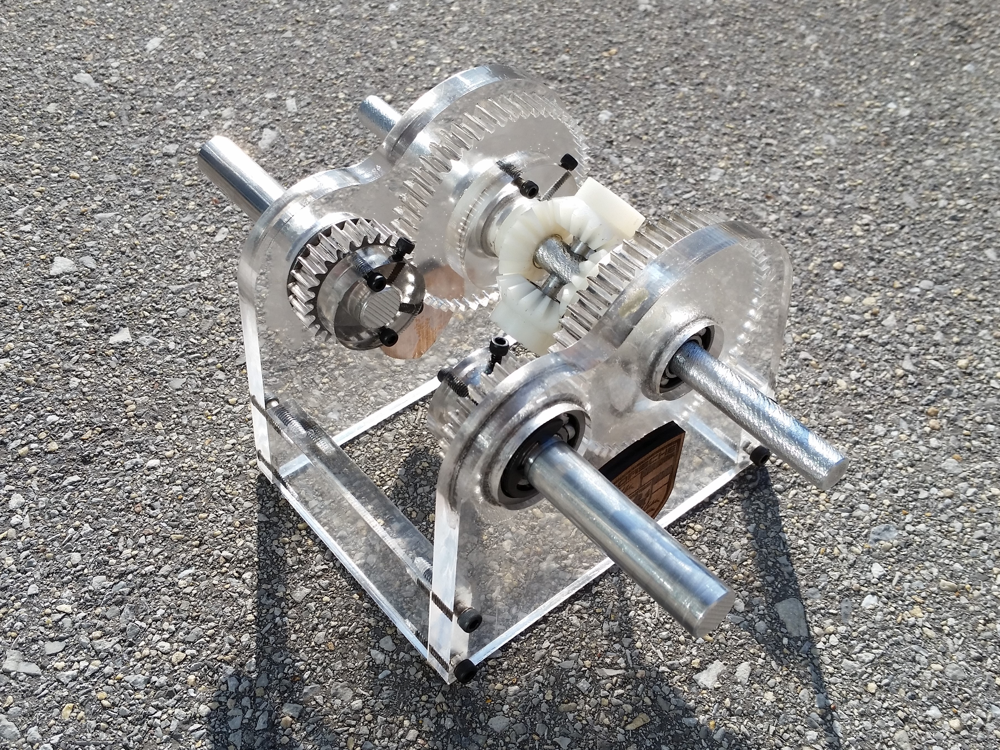
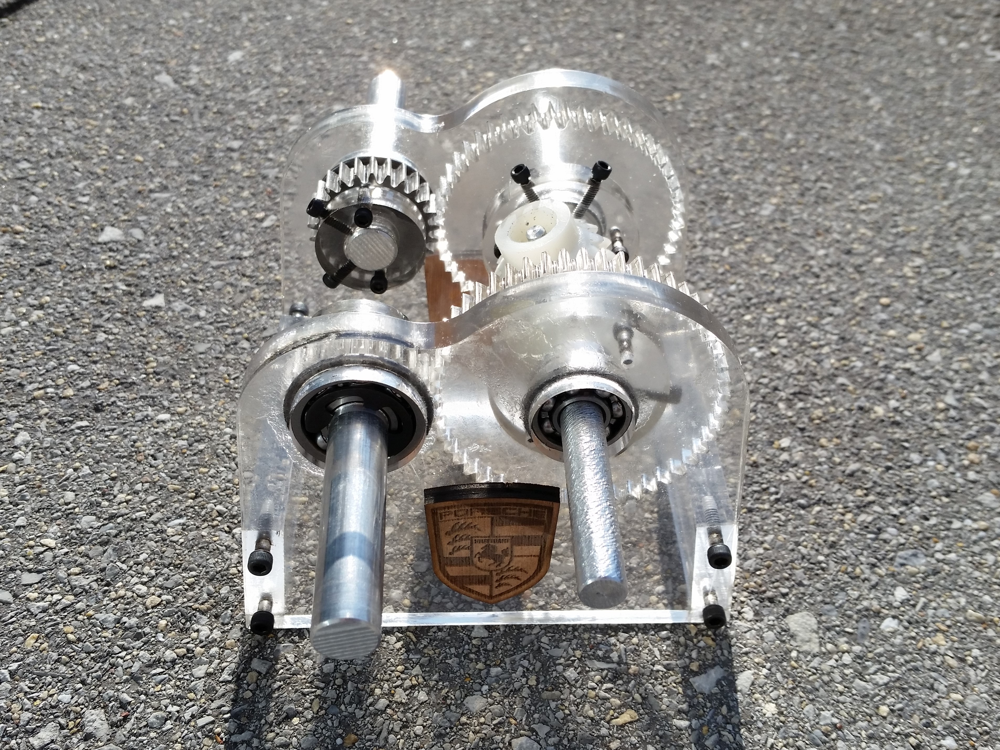

During my fall 2017 semester at Rowan University, a team of 3 other mechanical engineering students and I designed and
fabricated a differential gearbox satisfying the following constraints:

- 2 input shafts, both of which will be run at 1000 rpm.
- 1 output shaft that must output 500 rpm to a chain sprocket (2737T171 from McMaster Carr)
- Input shafts must be ½” and 2.7” above the base of the gearset
- Total cost of the machine should be below $60

The following video explains the design of our differential gearbox and shows the device in action:

## Gallery

### CAD Renders
 

 

 

### Build 
 

 

 

 
