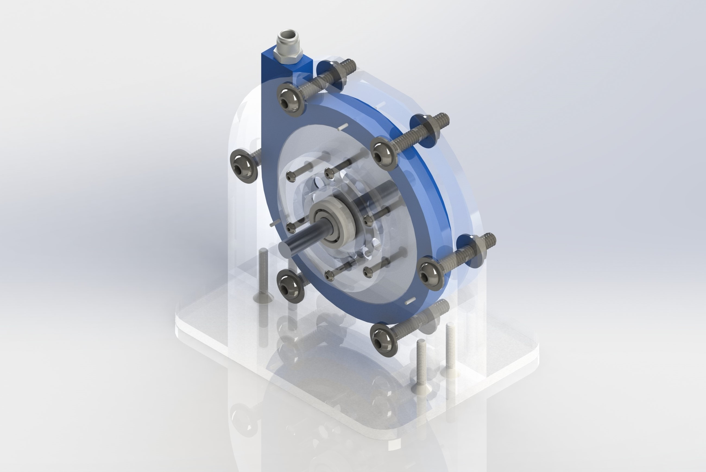
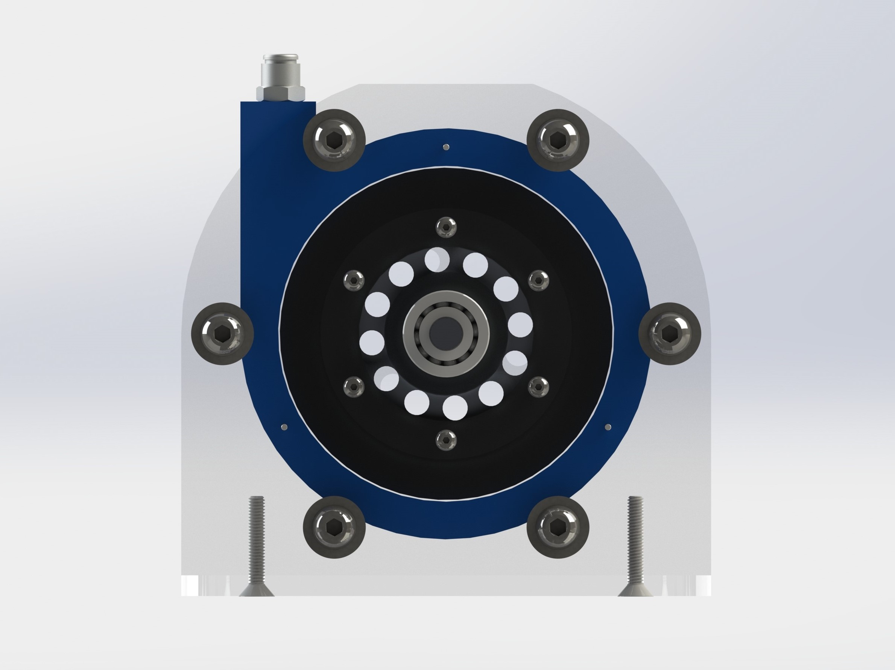
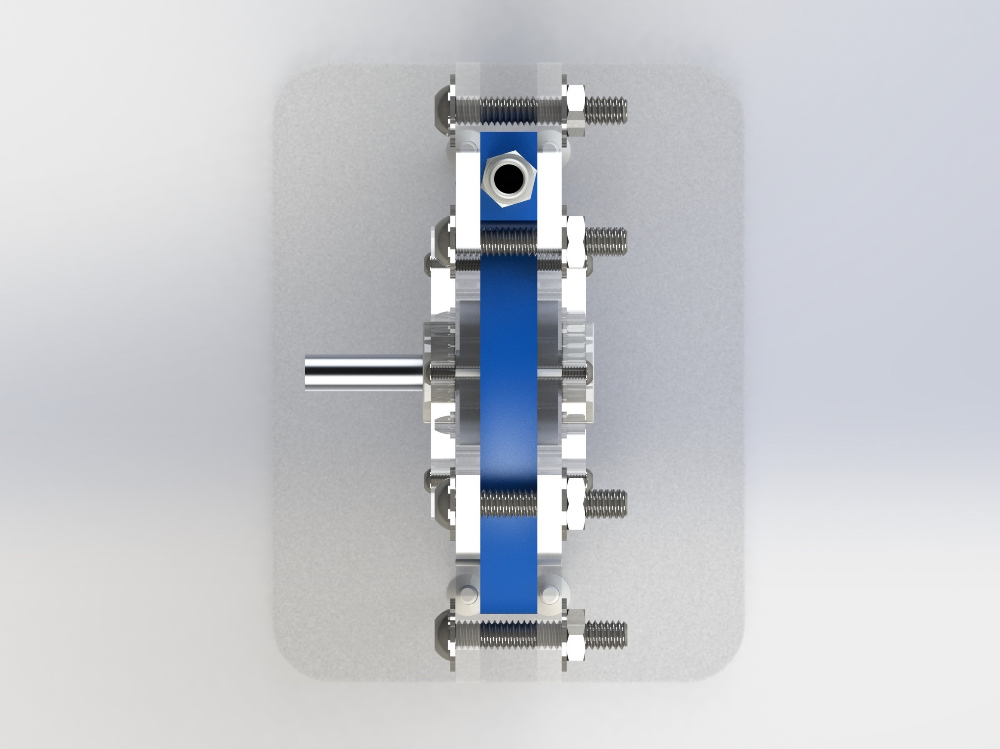
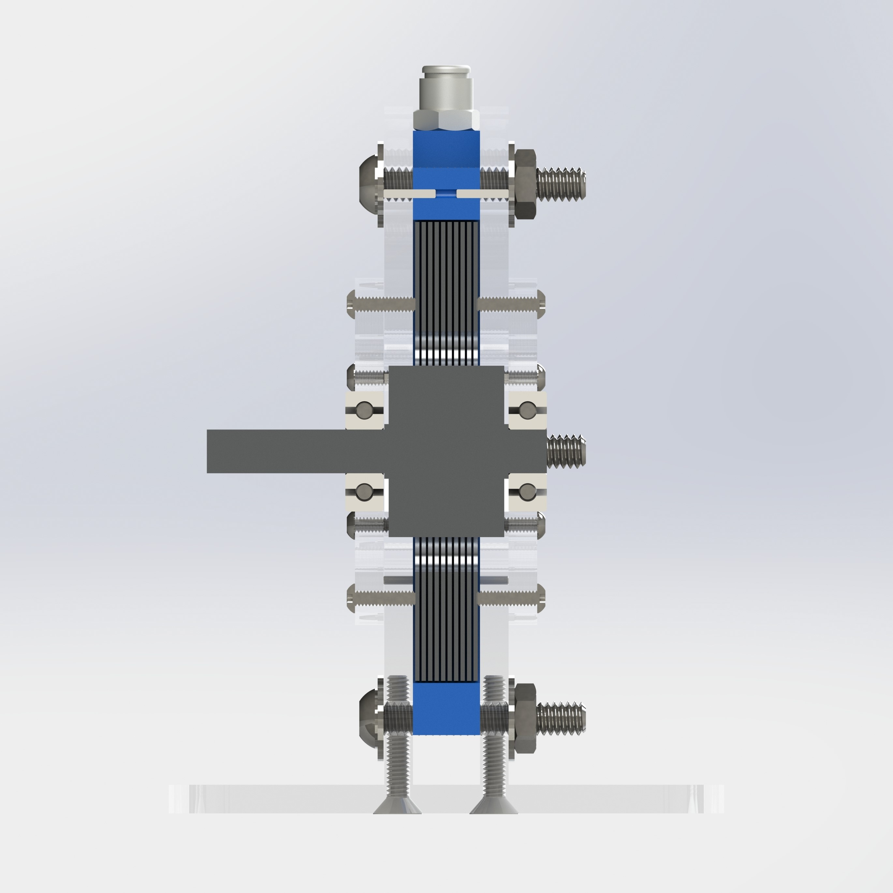
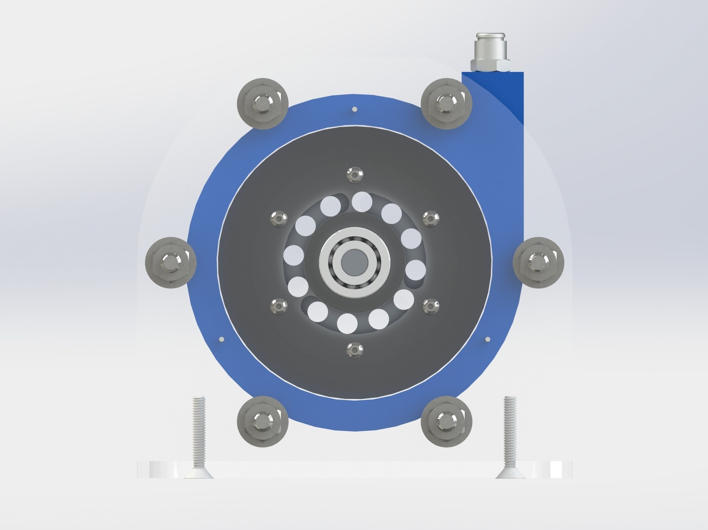

During my fall 2017 semester, Rowan University's American Society of Mechanical Engineers (ASME) student chapter decided to hold a Tesla turbine design competition. Excited by the prospect of pitting my design skills against my fellow engineering students, I jumped at the opportunity to design my own Tesla turbine…

...but alas, I ended up being the only participant.

So much for a competition, eh? 😉

## Solution
The turbine features a 3D printed body, shown in blue, with two sheets of acrylic to seal each side of the device using 6 screws, nuts, and washers. Since the screws were not designed to thread through the 3D printed body to minimize the chance of air leakage, 3 small pins were added to properly locate the 3D printed body in relation to the acrylic sheets and the shaft of the turbine. The shaft assembly, housed between two ball bearings, features 10 fixed hard disk drive (HDD) platters each separated by 0.016″ thick washers, cut from a water jet cutting machine.

When high pressure air is fed into the small pneumatic fitting on the top of the device, this air rushes into the cone-like passage within the 3D printed body, and exits into the main cavity of the turbine containing the HDD platters. Due the [boundary-layer effect](https://www1.grc.nasa.gov/beginners-guide-to-aeronautics/boundary-layer/), the high velocity air rushes into the small space in between each HDD platter and slows down, causing the shaft of the turbine to spin. 12 equivalent holes were drilled into each of the HDD platters to provide a place for air to exit into the surrounding environment.

## Results
After fabricating the device in my spare time, I realized that I did not provide a large enough tolerance between the outer edge of the HDD platters and the interior of the 3D printed body. As a result, the slightest amount of friction between these two components prevented the shaft of the turbine from rotating.

Unfortunately, I never got around to resolving this issue, as other projects and extracurricular activities became higher in priority.

## Gallery

 

 

 

 