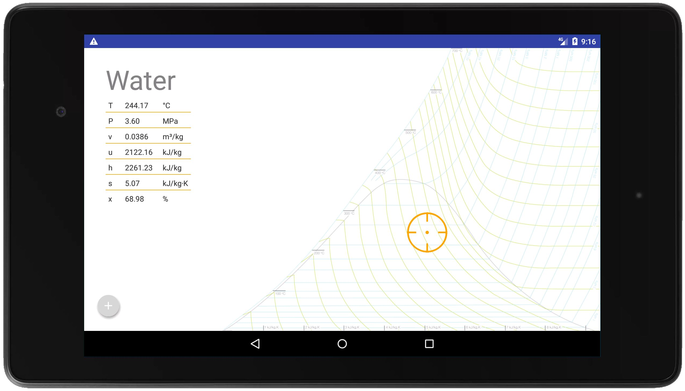

In December 2017, I volunteered to begin developing an Android version of _Clausius_, an iOS app developed by [Austin Carrig](https://web.archive.org/web/20220529200820/https://www.linkedin.com/in/austincarrig/) in collaboration with my thermal fluid-sciences professor, [Dr. Smitesh Bakrania](https://web.archive.org/web/20220529200820/https://www.linkedin.com/in/smitesh-bakrania-4681a166). _Clausius_ is a visual and intuitive app enabling the user to acquire the thermodynamic properties of water for a specified thermodynamic state with just the touch of a finger.

## Summary
The app features three charts, a temperature v.s. entropy (T-s) diagram, a pressure v.s. specific volume
(P-v) diagram, and a pressure v.s. enthalpy (P-h) diagram, which the user can easily swap between with the touch of a
button or the swipe of a finger. To make use of the app, the user simply touches anywhere on the displayed chart and all properties associated with the user-specified thermodynamic state will be automatically calculated and displayed in a table near the edge of the screen.

## Motivation
This app was created to eliminate the need to reference steam tables or physical copies of T-s, P-v, or P-h diagrams, which often slow the problem-solving process considerably. With such an app, users can efficiently work through complex problems and learn thermodynamic concepts without having to tediously calculate the thermodynamic property values needed to solve such problems. The following promo video briefly shows the functionality of the app and its usefulness as a problem-solving tool.

<iframe width="560" height="315" src="https://www.youtube.com/embed/U34Dn5NZacA?si=i_yLNwsw8BdlTKO-" title="YouTube video player" frameborder="0" allow="accelerometer; autoplay; clipboard-write; encrypted-media; gyroscope; picture-in-picture; web-share" referrerpolicy="strict-origin-when-cross-origin" allowfullscreen></iframe>

## Gallery

**Pressure-Enthalpy (P-h) Diagram:**
 

**Pressure-Volume (P-v) Diagram:**
 

**Temperature-Entropy (T-s) Diagram:**

**Menu Closed:**
