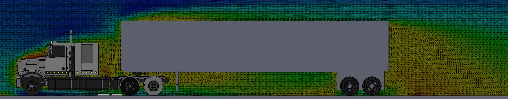

During my spring 2018 semester at Rowan University, a fellow mechanical engineering student and I were tasked with creating a project of our choice involving some kind of fluid flow analysis for Thermal-Fluid Sciences II. As such, we decided to do a theoretical investigation of the aerodynamic efficiency of a typical semi-trailer truck as compared to one retrofitted with more aerodynamic features.

## Results
After performing many different flow simulations on both truck variants at speeds ranging from 25-85mph, we experimentally determine the relationship between speed vs drag, computed the truck's coefficient of drag at various speeds, and calculated that by using our “aero” truck as opposed to a stock truck for commercial purposes, one can save $6,098 on fuel costs annually assuming a distance driven of 45,000 miles.

## Challenges
As you might suspect, one of the most challenging aspects of this project was finding the time to run a sufficient number of flow simulations to provide the data necessary to compare our modified truck with the regular variant.

## Gallery

### Results
 

 

 

 

### CAD

#### Aerodynamic Truck
 

 

 

 

#### Stock Truck
 

 

 

 

### Flow Simulation Comparison

#### Pressure Cut Plot - Side View
**Stock Truck:**
 

**Aerodynamic Truck:**
 

#### Flow Velocity Cut Plot - Side View
**Stock Truck:**
 

**Aerodynamic Truck:**
 

#### Flow Trajectory - Front View
**Stock Truck:**
 

**Aerodynamic Truck:**
