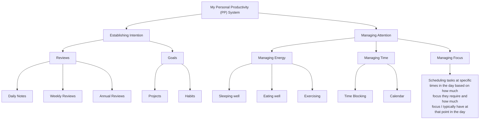

import Drawio from "@theme/Drawio";
import pkmArchitecture from "!!raw-loader!./pkm-architecture.drawio";

**This is a work in progress. Publishing so I have motivation to finish!**

Goals of this system:

- The system should allow me to practically retrieve any message, thing I've read/watched, or content I've saved.
- The system should be able to **capture** my thoughts, TODOs, and other notes from _anywhere_ (offline/online or on mobile or desktop) and provide an easy way to include the context of the thing
- The system should make use of community-based platforms when it makes sense to do so (e.g. Letterboxd, Goodreads)

Why Zotero for everything?

- It is **structured**
- It is **free** and **open source**

// (Include limitations)

<Drawio content={pkmArchitecture} />
